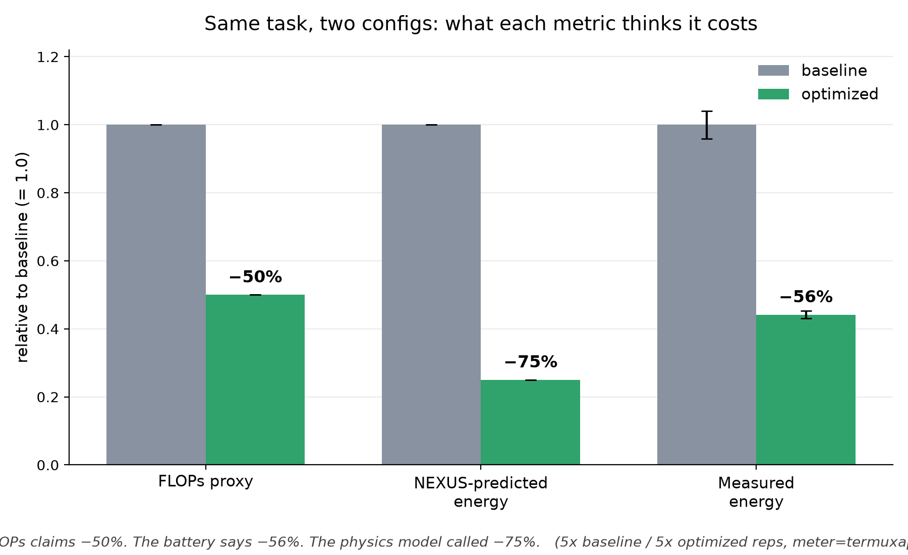

# Joulehound

**FLOPs can't measure what your battery pays. Joulehound catches them lying — with the device's own power meter.**

An agentic AI workload (decode a 6-layer multispectral QR, act on it with a
local LLM) runs in two configurations on Arm silicon while Joulehound
integrates real battery discharge into joules. Three verdicts on the same
optimization, on a Samsung Galaxy Tab S9+ (Snapdragon 8 Gen 2):



> **FLOPs claimed −50%. A physics-grounded transistor-operation model
> predicted −75%. The battery said −56%.** Both proxies missed — in opposite
> directions. Measurement didn't.

| config | mean energy | avg power | duration | CoV (N=5) |
|---|---|---|---|---|
| baseline (re-decode + LLM call every step) | 27.673 J | ~11.1 W | 2.23 s | 4.1% |
| optimized (pollard-governed: decode once, gate, early-stop) | 12.215 J | ~10.0 W | 1.14 s | 2.5% |

Idle system floor (screen off, radios quiet, measured separately): **1.343 W**.
Subtracting floor × duration per rep, the **dynamic** energy the optimization
actually controls fell **−57%**.

## The three findings

**1. FLOPs understated the win (−50% vs −56%).** The proxy counts steps; it
cannot see memory traffic, DVFS state, or anything silicon actually does.

**2. The transistor-operation model overshot (−75% vs −56%) — and the reason
is the point.** Our β table prices image accesses at DRAM rates (Horowitz
ISSCC 2014: ~640 pJ per 32-bit access). But the 490×490 workload image is
~720 KB — it fits in the Snapdragon's cache, so the silicon served the
"expensive" redundant decodes from SRAM at a fraction of the modeled cost.
This is an experimental demonstration of exactly why nexus-ml-metrics ships
its β table empty pending per-silicon calibration: uncalibrated
physics-grounded prediction beats FLOPs directionally, and measurement beats
both. (nexus-ml-metrics v0.0.1's `predict_energy()` is a stub; we load the
Horowitz values through its public `BetaCoefficientTable.set()` API — see
`joulehound/predicted.py`. α is uncalibrated, so we only ever claim ratios;
the chart is normalized, so α cancels.)

**3. Bonus exhibit — DVFS makes FLOPs even blinder.** In an earlier run
without steady-state warm-up (`results_ramp.csv`), the *identical* baseline
code executed on efficiency cores at ~2 W for ~12.7 J/rep, then migrated to
performance cores at ~9.6 W for ~30 J/rep as the governor ramped. Same
program, same FLOPs, **~2.4× energy difference** purely from core/frequency
choice. The steady-state protocol (3 unmeasured warm-ups) exists because of
this run, and we publish it as data, not as an outtake.

## How it works

- **Workload** (`joulehound/agent.py`): multispecqr threshold decode of a
  6-payload, version-6 QR (seconds of deterministic compute) + an LLM brain —
  real llama.cpp inference when `JOULEHOUND_MODEL` points at a GGUF,
  deterministic fallback otherwise (CI-safe, and the controlled experiment
  used for the chart). `baseline` re-decodes and re-queries every step;
  `optimized` is pollard-governed: decode once and cache, gate redundant
  calls, early-stop.
- **Meter** (`joulehound/power.py`): three backends behind one interface.
  `fake` (laptop/CI), `android` (battery sysfs at 200 Hz — blocked by SELinux
  on recent One UI), `termuxapi` (the sanctioned Android battery API via
  Termux:API; ~1 Hz because each reading is an IPC round-trip). Slow-meter
  correctness: both edges of every rep are sampled synchronously, the t=0
  reading is taken *before* the clock starts so meter latency is never billed
  to the workload, and samples are trapezoid-integrated over real
  timestamps. Vendor unit chaos (µA vs mA, µV vs mV vs V, sign conventions)
  is normalized and unit-tested (`test_meter_scaling.py`, 7 cases, including
  a stubbed termux-battery-status).
- **Prediction** (`joulehound/predicted.py`): operation counts derived from
  the workload's actual structure × Horowitz per-op energies, through the
  nexus-ml-metrics coefficient API.
- **Integrity**: `bench.py` refuses to run if a multispecqr round-trip fails
  — a missing native backend can otherwise silently turn "decode" into a
  no-op that still burns plausible joules.

## Quickstart (any machine, no hardware)

```bash
git clone https://github.com/b-urge/Joulehound && cd Joulehound
python3.12 -m venv .venv && source .venv/bin/activate
pip install -r requirements.txt
python bench.py --config baseline  --reps 5 --meter fake
python bench.py --config optimized --reps 5 --meter fake
pip install matplotlib && python make_chart.py
```

## On-device (Termux, real measurement)

Install Termux **and** Termux:API from F-Droid (not Play Store), then:

```bash
git clone https://github.com/b-urge/Joulehound && cd Joulehound
bash termux-setup.sh
python bench.py --config baseline  --reps 5 --warmup 3 --meter termuxapi
python bench.py --config optimized --reps 5 --warmup 3 --meter termuxapi
```

Clean-run protocol: device **unplugged**, airplane mode (WiFi re-enabled only
if driving over SSH), screen off (`termux-wake-lock`), Termux + Termux:API
set to Battery → Unrestricted, 3 warm-up reps so the DVFS governor commits
before the clock starts.

### Termux field notes (why termux-setup.sh looks like that)

Recent One UI denies battery sysfs outright → the meter speaks the Android
battery API instead. Termux ships Python 3.14, past the wheel horizon:
nexus-ml-metrics drags in pandas it never imports (`--no-deps`); multispecqr
0.4.1 is pure python wearing a `<3.13` metadata cap (`--ignore-requires-python`,
else pip silently hands you a skeleton 0.0.1a0); there is no prebuilt OpenCV
anywhere, so `compat/cv2.py` routes multispecqr's decoder to its own pyzbar
fallback; Termux's zbar package links libdbus without declaring it
(`pkg install dbus`); and llama-cpp-python's loader predates PEP 738's
`sys.platform == "android"` (one-line patch in the script). Each of these is
also an upstream bug report waiting to happen.

## Data

`results_steady.csv` — the headline numbers (5+5 reps, 3 warm-ups, screen
off, unplugged). `results_ramp.csv` — the DVFS exhibit (same protocol minus
warm-ups). Idle floor measured separately at 1.343 W over 46.5 s.

## Honesty & limitations

Ratios only (α uncalibrated). ~1 Hz sampling bounds per-rep integration
error; both configs pay identical meter overhead, which cancels in the
normalized comparison. Reps share one battery state and thermal envelope;
CoV is reported on every run. The controlled experiment uses the
deterministic brain so config differences isolate the decode-redundancy
pathology; the real-LLM path is demonstrated on-device (see video) but its
symmetric per-call cost would dominate both configs equally.

## Credits

NEXUS/TOML transistor-operation model: [Syed, FLAIRS 2026](https://journals.flvc.org/FLAIRS/article/view/141781).
Per-operation energies: Horowitz, ISSCC 2014
([DOI 10.1109/ISSCC.2014.6757323](https://doi.org/10.1109/ISSCC.2014.6757323)).
Built on [multispecqr](https://pypi.org/project/multispecqr/),
[pollard](https://pypi.org/project/pollard/),
[nexus-ml-metrics](https://pypi.org/project/nexus-ml-metrics/), and
[llama.cpp](https://github.com/ggml-org/llama.cpp)
(via [llama-cpp-python](https://github.com/abetlen/llama-cpp-python)).
MIT license.
